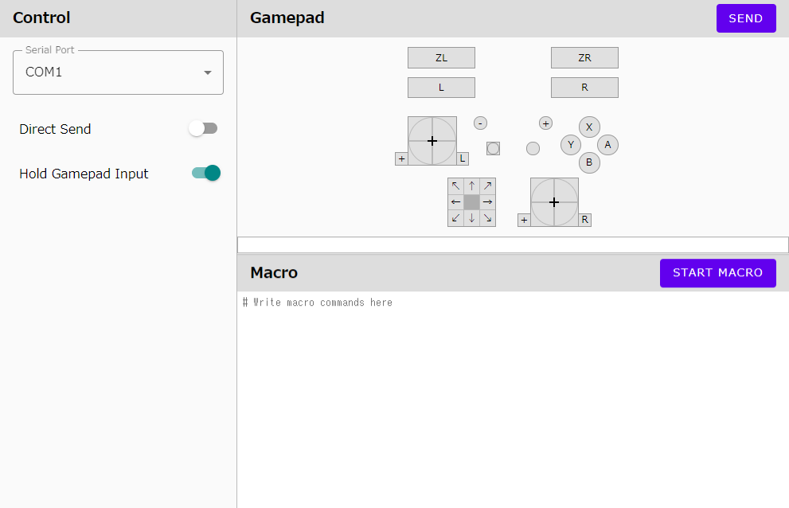

# Switch Serial Controller

A device and web application for operating Nintendo Switch from a browser.

Read each README's for more details.

Device: [README](./device/README.md)

Web Server: [README](./controller/README.md)