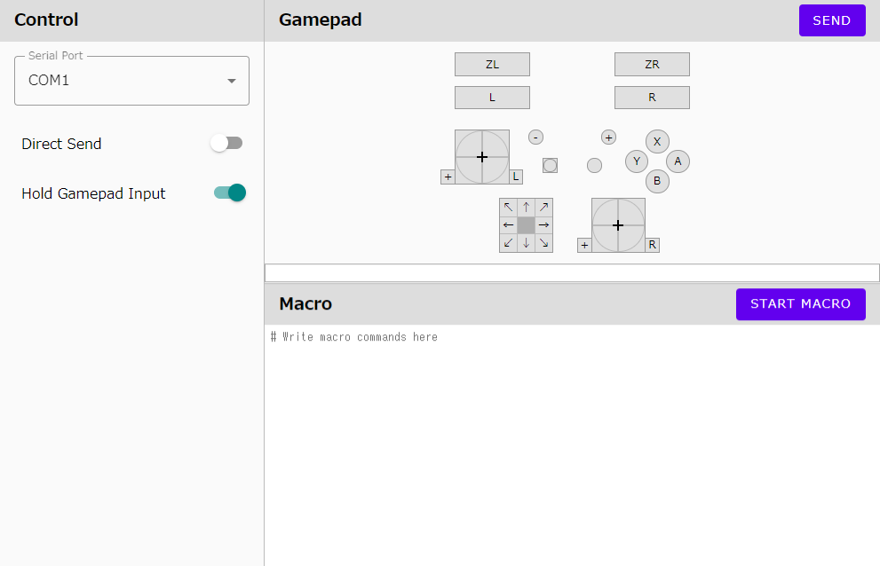

# Switch Serial Controller - Server

A web application that can manipulate Nintendo Switch from web page. 

## Getting Started

```sh
git clone --recursive https://github.com/r-ralph/Switch-Serial-Controller.git
cd Switch-Serial-Controller
cd controller
./gradlew :server:run
```

Then, open `http://localhost:8080`

## How to use

1. Prepare a device is treated as the Pro Controller.

    See [device's README](../device/README.md)

2. Connect the device to Switch and PC.
3. Run server

    ```sh
    # For Windows(cmd.exe)
    gradlew :server:run

    # For *nix
    ./gradlew :server:run
    ```

4. Access to `http://localhost:8080`.
5. Select corresponding port id and control gamepad view.
6. Click `SEND` button.

## Features

|  |
|:-----------|

### Control View

- Serial Port
    - A name of serial port which send any commands to. 
- Direct Send
    - If turned on, send a command immediately when you change any button in Gamepad view.
- Hold Gamepad Input
    - If turned on, button, stick, and hat buttons becomes like toggle button.
    - If turned off, it behaves like real controller.

### Gamepad View

#### Buttons

If it is dark gray, it is pressed.

#### Sticks

Click and hold a black reticle to move. 
A button at the bottom right if for pressing stick. 
Click bottom left button (`+`) to reset the reticle to the center. 

#### Current input text view

The current gamepad input values are displayed below the gamepad. It can be used as a macro command.

### Macro View

Puts macro text and click `START MACRO` to process commands in the order.
If there is no more command that can be executed, stop executing the macro.

#### Macro commands

The following commands are available.

- Change State
    - Puts the controller in the specified state
    - Joins the following keys with a semicolon.
        - Buttons
            - `A,B,X,Y,L,R,ZL,ZR,CLICK,RCLICK,START,SELECT,HOME,CAPTURE` 
        - 8-direction hat
            - `HAT@{direction:0-8}`
            - 8 means center and top is 0. The numbers increase clockwise.
        - Sticks
            - `{L|R}STICK@{degrees:0.0-360.0},{tilt:0.0-1.0}`
            - When the tilt is 1, the stick is completely toppled.
- Wait
    - Waits specified milli seconds to do next command.
    - `wait {number}`
- Label
    - Indicates the location where you can move by Goto command.
    - `:{label name}`
- Goto
    - Jumps to the specified label position.
    - `goto {label name}`
- Comment
    - These lines are ignored as comment.
    - Starts with `#` or empty line.

#### Macro example

```
# Press the A,B,X,Y button in sequence every second.

:head
A
wait 1000
B
wait 1000
X
wait 1000
Y
wait 1000
goto head
```

```
# Keep the left stick up, and click the A button repeatedly.

:head
A;LSTICK@90,1
wait 50
LSTICK@90,1
wait 50
goto head
```

## LICENSE

```
Copyright 2020 Tamaki Hidetsugu / Ralph

Licensed under the Apache License, Version 2.0 (the "License");
you may not use this file except in compliance with the License.
You may obtain a copy of the License at

    http://www.apache.org/licenses/LICENSE-2.0

Unless required by applicable law or agreed to in writing, software
distributed under the License is distributed on an "AS IS" BASIS,
WITHOUT WARRANTIES OR CONDITIONS OF ANY KIND, either express or implied.
See the License for the specific language governing permissions and
limitations under the License.
```
